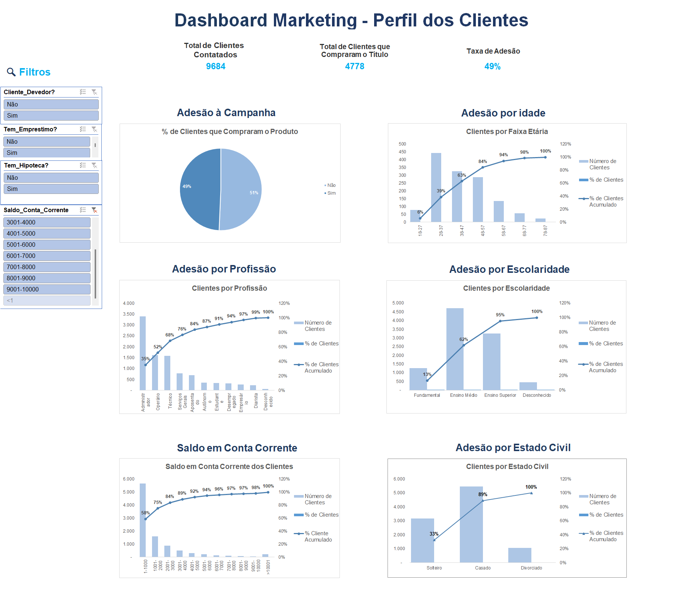

# 📊 Análise do Perfil de Clientes para Campanha de Investimentos

## 📌 Contexto do Projeto

Com a finalidade de entender melhor o perfil dos clientes para potencializar a venda de um produto de investimento, a área de marketing realizou uma campanha direcionada para parte da base de clientes.

A campanha teve duração de **3 meses** e foi realizada **em todo o Brasil**. Após o seu encerramento, a equipe de marketing disponibilizou a base de dados `bank_marketing.xlsx` para que a área de Analytics realizasse uma análise sobre o perfil dos clientes e os resultados obtidos.

O objetivo é gerar **insights que auxiliem na definição do público mais propenso a adquirir o produto em futuras campanhas**.

---

## 🎯 Problema de Negócio

**Qual é o perfil dos clientes mais propensos a comprar o produto de investimento?**

---

## 📂 Base de Dados

A base utilizada contém informações sobre os clientes, incluindo:

- Idade
- Profissão
- Estado civil
- Nível de escolaridade
- Situação de crédito
- Saldo em Conta Corrente
- Possui hipoteca
- Possui empréstimo

Essas variáveis permitem analisar características demográficas, financeiras e comportamentais dos clientes.

---

## 🔎 Análise Exploratória de Dados (EDA)

Foi realizada uma **Análise Exploratória de Dados** para identificar padrões e possíveis relações entre o perfil dos clientes e a adesão ao produto de investimento.

As análises incluíram:

- Distribuição de clientes por idade
- Perfil profissional dos clientes
- Relação entre estado civil e adesão ao investimento
- Impacto do nível de escolaridade
- Situação de crédito dos clientes
- Relação com outros produtos financeiros (hipoteca e empréstimo)

---

## 📊 Dashboard (Excel)

Além da análise exploratória, foi desenvolvido um **dashboard no Excel** para facilitar a visualização dos principais insights encontrados na análise.

O dashboard apresenta:

- Distribuição dos clientes por perfil
- Comparação entre clientes que aderiram ou não ao produto
- Principais características dos clientes com maior probabilidade de conversão
- Indicadores visuais para apoiar a tomada de decisão



---

## 💡 Principais Insights

Alguns exemplos de insights que podem ser obtidos:

- Faixa etária com maior adesão ao investimento
- Profissões com maior probabilidade de conversão
- Relação entre nível educacional e interesse em investimentos
- Impacto da situação de crédito na decisão de compra
- Relação entre possuir outros produtos financeiros e aderir ao investimento

---

## 🛠️ Ferramentas Utilizadas

- Excel
- Tabelas Dinâmicas
- Gráficos
- Dashboard

---

## 📈 Objetivo do Projeto

Transformar dados brutos em **insights estratégicos** que apoiem a área de marketing na tomada de decisão, permitindo direcionar futuras campanhas para clientes com maior probabilidade de aderir ao produto de investimento.

---

## 📎 Estrutura do Projeto
```
bank_marketing_analysis/
│
├── bank_marketing.xlsx
│
├── analises.xlsx
│
├── dashboard.xlsx
```
